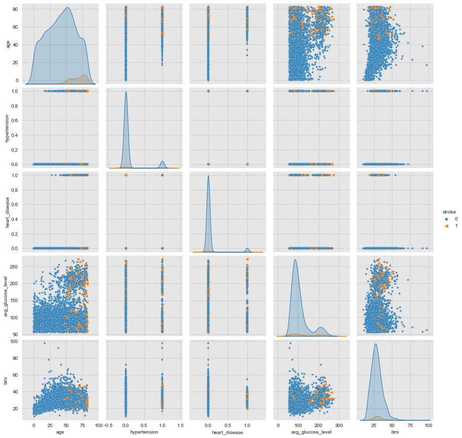
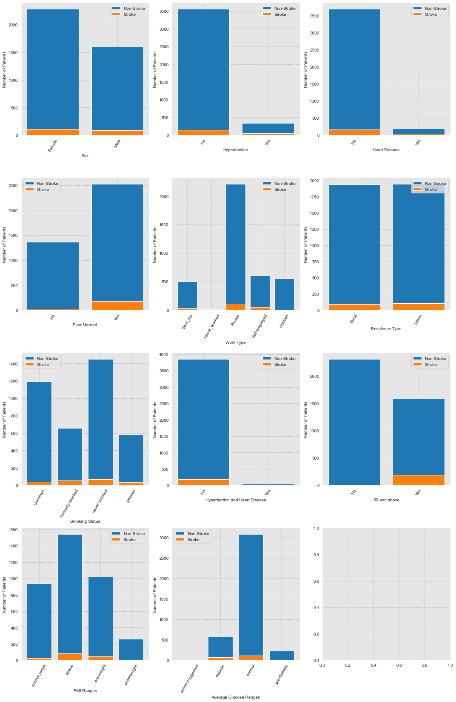

# Predicting Strokes
### _with only 7 features_
---
---
## Introduction 
Every year, more than 795,000 people in the United States have a stroke [CDC.gov](https://www.cdc.gov/stroke/facts.htm). About 610,000 of these are first or new strokes [CDC.gov](https://www.cdc.gov/stroke/facts.htm). About 87% of all strokes are ischemic strokes, in which blood flow to the brain is blocked [CDC.gov](https://www.cdc.gov/stroke/facts.htm). Strokes are the No. 5 cause of death and a leading cause of disability in the United States [American Stoke Association](https://www.stroke.org/en/about-stroke). From 1990 to 2019, the change in the prevalence of stroke in the general population *increased* by about 60% [newsroom.heart.org](https://newsroom.heart.org/news/u-s-stroke-rate-declining-in-adults-75-and-older-yet-rising-in-adults-49-and-younger). **80% of strokes are preventable** [American Stoke Association](https://www.stroke.org/en/about-stroke). 

## Objectives
Find 7 features that provide the most accurate assesment of strokes in patients. 

## Business Understanding
Kaiser Permenente is starting a new public health campaign about stroke prevention. The target audience are people 55+. Kaiser wants to provide an unofficial stroke-risk assessment to individuals through an app or online based interface. With the target audience in mind, Kaiser wants this to be as simple as possible.  An example marketing slogan could be, "take 7 minutes, answer 7 questions, to see if you are at risk of having a stroke" or "Know your 7." Again, bearing in mind this age range is not known for their tech savviness, the questions should be easy to answer multiple choice (ie categories) that can be read and answered quickly. This app or online feature can direct both members and non members to resources to better understand their risk factors based on the answers they provide. This is not an official diagnosis and is instead meant to direct people to conversations with their primary physician by giving them an interactive way to take their health into their own hands. 

---

## Data Understanding
This dataset contains 5110 observations with 12 attributes (11 clinical features) for predicting stroke events. 

### Attribute Information

| Column     | Description   |
|------------|:--------------|
| `id`               | **unique identifier**  |
| `gender`           | **"Male", "Female" or "Other"**  |
| `age`              | **age of the patient** |
| `hypertension`     | **0 if the patient doesn't have hypertension, 1 if the patient has hypertension**  |
| `heart_disease`    | **0 if the patient doesn't have any heart diseases, 1 if the patient has a heart disease**   |
| `ever_married`     | **"No" or "Yes"**  |
| `work_type`        | **"children", "Govt_jov", "Never_worked", "Private" or "Self-employed"**   |
| `Residence_type`   | **"Rural" or "Urban"**  |
| `avg_glucose_level`| **average glucose level in blood**  |
| `bmi`              | **body mass index** |
| `smoking_status`   | **"formerly smoked", "never smoked", "smokes" or "Unknown"***  |
| `stroke`           | **1 if the patient had a stroke or 0 if not**  |
|    **_*Note:_**      | _"Unknown" in_ `smoking_status` _means that the information is unavailable for this patient_ |

### Acknowledgements
Data comes from the [Stroke Prediction Dataset](https://www.kaggle.com/datasets/fedesoriano/stroke-prediction-dataset) and can be found on [kaggle](https://www.kaggle.com).

---

## Looking at the Raw Data
### Data Frame Info

**NOTES:** There are 201 null values in `bmi`

### Distribution of Target Feature

**NOTES:** There is an immense class imbalance

### Distributions of Other Features

### Visualizing Distributions

**NOTES:** There are 3 features that are not categorical and do not fit into the goal of the client: to have multiple choice questions. 

### Findings
1. `gender`
 - There is only 1 'other' value, for simplicity I will drop this 1 row.
 - About 1000 more women than men in this dataset.
 
 
2. `age`
 - The youngest patient is under 1 yo. Oldest patient is 82.
 - Decent distribution, 
 - Average age of patients in this dataset is 43 years old. 
 
 
3. `hypertension`
 - Binary, 1 if the patient has hypertension.
 - Very similar distribution as target feature.
 
 
4. `heart_disease`
 - Binary, 1 if the patient has heart disease.
 - Almost identical distribution as target feature.
 - I am curious how `hypertension` & `heart_disease` will correlate with eachother. 
 
 
5. `ever_married`
 - About 65/35 split with majority of patients listed as 'Yes.'
 
 
6. `work_type`
 - With only 5 categories it is not surprisingly, more than half answered 'Private.'
 - The other 4 make up little more than 40%.
 - 'Never_worked' is less than 1% (very likely children)
 
 
7. `Residence_type`
 - Almost 50/50 split between 'Urban' and 'Rural.'
 
 
8 & 9. `avg_glucose_level` & `bmi` 
 - continuous features that are both skewed positively.
    - `bmi` is missing 201 values (3.93%). Of those missing values, 40 are stroke patients.
    - because of this missing data an imputer is required for modeling

10. `smoking_status`
 - about 30% of patients are listed as 'Unknown.'
 
---

# Tranforming Data After Train Test Split
### Pair Plot of Training Data

**NOTES:** `age` appears to be a significant feature. 
The pair plot is great when comparing continuous features, however, it is useless when comparing two binary features, notice `hypertension` - `heart_disease`. Technically these features are categorical, with 1 and 0 representing "Yes" and "No," so it is not surprising the pairplot does not reveal much about these features given they are masquerading around under the ruse of numeric values. On that same note, it is important to note, the pairplot excludes categorical features altogether. Notice `gender`, `ever_married`, `work_type`, `Residence_type`, and `smoking_status` are absent. These features will need to be explored separately. But first, based on shortcomings of the pair plot, I would like to add a feature to better understand the relationship between `hypertension` and `heart_disease`. Secondly, based on the insight of the pairplot, I want to add a feature that separates out patients who are 50 and up. Next, I will break down `bmi` and `avg_glucose_level` into categorical ranges as this fits with the needs of the client to have multiple choice questions. 

### Adding Features
1. `age_50+`
 - The values in this column will be 
   - 1 : patients 50 and above
   - 0 : patients 49 and below 
   
   
2. `hyper_heart`
 - The values in this column will be 
   - 1 : patients with hypertension and heart disease 
   - 0 : if patients do not have BOTH hypertension and heart disease.
   
   
3. `bmi_range`
 - The values in this columns will be
   - 'underweight' : patients with bmi < 18.49
   - 'normal range' : patients with bmi between 18.5 and 24.9
   - 'overweight' : patients with bmi between 25.0 and 29.9 
   - 'obese' : patients with bmi 30 or greater
  - Values for bmi ranges determined by 'WHO classification of weight status' table [National Library of Medicine](https://www.ncbi.nlm.nih.gov/books/NBK535456/figure/article-18425.image.f1/).
  
  
4. `avg_glucose_range`
 - The values in this columns will depend on age
   - for children < 5.99 (0-5 years old) :
     - 'normal' : patients with average glucose level < 180
     - 'action suggested' : if greater
     - *note: I used 'action suggested' for children as I did not find much information on this age range and was uncomfortable labeling them 'diabetic' or 'pre-diabetic'*
   - for children between 6 and 10 
     - 'normal' : patients with average glucose level < 140 
     - 'action suggested' : if greater
   - for patients older than 10
     - 'normal' : patients with average glucose level < 116.99
     - 'prediabetic' : patients with average glucose level between 117 and 136.99
     - 'diabetic' : if greater that 137
  - Values for childrens ranges determined by 'Nationwide Children’s Hospital Diabetes Center Target Blood Glucose Ranges' table [Nationwide Children’s Hospital](https://www.nationwidechildrens.org/family-resources-education/health-wellness-and-safety-resources/resources-for-parents-and-kids/managing-your-diabetes/chapter-three-monitoring-blood-glucose).
  - Values for adult ranges determined by 'A1C and Estimated Average Glucose Levels' table [Medical News Today](https://www.medicalnewstoday.com/articles/a1c-chart-diabetes-numbers). This was the hardest as there is some discrepancy in these ranges. For example, the 'Nationwide Children’s Hospital Diabetes Center Target Blood Glucose Ranges' table groups anyone from ten years and up as having a target range from 70 to 120, however the 'A1C and Estimated Average Glucose Levels' table labels 'normal' as below 117. I chose to use the data from these two tables despite this discrepancy because they are from credible resources. 
  

### Distribution of Categorical Features from Train Data

**NOTES:** 
- The added feature `age_50+` further suggests that age is the most significant feature. 
- Other important factors seem to be `bmi_range`, and `avg_glucose_range`, sex (`gender`), `hypertension`, `heart_disease`, & `smoking_status`. 
- The least important feature appears to be `Resident_type` followed by `work_type` then `ever_married`. 
  - `ever_married` is visually misleading. It appears marriage is a significant predictor of strokes, however,  68% of 'never_married' patients are children and young adults (under 25 years old) and we already know `age` is the most significant predictor of strokes. 

Of the added features:
- I will keep:
 - `age_50+`
 - `bmi_range`
 - `avg_glucose_range`

- And drop: 
 - `hyper_heart`
 

Of the original features: 
- I will drop the 3 continuous features (*note: they have been replaced with the added categorical features*)
 - `age`
 - `bmi`
 - `avg_glucose_level`
 
---

